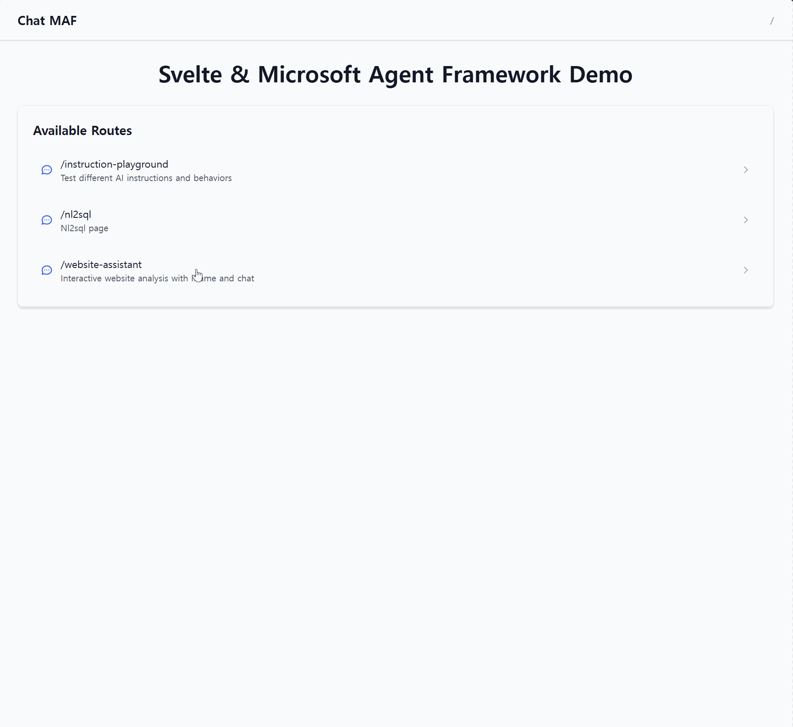

# Microsoft Agent Framework Demo

A full-stack application demonstrating Microsoft Agent Framework with SvelteKit frontend.

## Features

### `/instruction-playground`
Interactive environment for testing different AI instruction prompts and behaviors.
- Experiment with various instruction templates
- Create custom AI assistants with specific roles and behaviors
- Real-time streaming responses

**API Endpoint:** `POST /instruction`

### `/nl2sql`
Natural language to SQL translation with interactive database explorer.



- Ask questions about databases in natural language
- 6-step workflow: entity extraction → schema mapping → SQL generation → execution
- Visual ER diagram with table relationships
- Interactive database and table selection
- Automatic error correction with retry logic

**API Endpoint:** `POST /nl2sql`

### `/website-assistant`
Progressive website analysis tool with iframe viewer and intelligent Q&A.
- View and analyze websites in embedded iframe
- Ask questions about website content
- Two-stage scraping: static HTML scraper → Playwright (if needed)
- Both scrapers convert content to markdown for consistent LLM processing
- Playwright includes auto-scroll for lazy-loaded content
- Keyboard shortcut: `Ctrl/Cmd + `` to toggle chat

**API Endpoint:** `POST /website-assistant`

## Quick Start

### Prerequisites

**Spider Database Setup (Required for NL2SQL):**
Download and setup the Spider dataset:
```bash
# Install gdown for Google Drive downloads
cd backend
uv pip install gdown

# Download Spider dataset (206 MB)
# If the file ID below doesn't work, get the latest link from: https://yale-lily.github.io/spider
cd database
uv run gdown 1403EGqzIDoHMdQF4c9Bkyl7dZLZ5Wt6J -O spider.zip

# Extract databases and generate metadata
cd ..
uv run python database/setup_spider.py      # Extract databases
uv run python database/generate_m_schema.py # Generate metadata
```
This installs 166+ SQLite databases and generates M-Schema metadata for intelligent schema mapping.

**For Observability (Optional):**
Deploy Aspire Dashboard to AKS for OpenTelemetry traces:
```bash
kubectl apply -f aspire-dashboard.yaml
# Wait for external IP
kubectl get service aspire-dashboard --watch
```

### Option 1: Full-Stack Application (FastAPI + SvelteKit)

**Backend:**
```bash
cd backend
uv run fastapi dev main.py
```

**Frontend:**
```bash
cd frontend
npm install
npm run dev
```

Visit `http://localhost:5173`

### Option 2: DevUI (Agent Development & Testing)

**Launch DevUI for agent development:**
```bash
cd backend
uv run devui ./agents --port 8080
```

Visit `http://localhost:8080`

**DevUI Features:**
- Interactive agent testing without frontend
- Real-time conversation debugging
- Agent discovery and introspection
- Multi-agent orchestration testing

> **Note:** DevUI requires tools to be defined within `agent.py` files. See [DEVELOPMENT.md](DEVELOPMENT.md) for details on DevUI integration requirements.

---

**Detailed documentation:** See [DEVELOPMENT.md](DEVELOPMENT.md) for setup instructions, architecture details, and usage examples.
